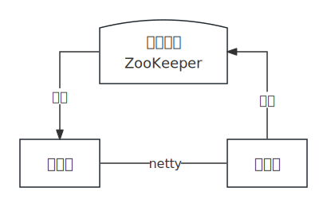
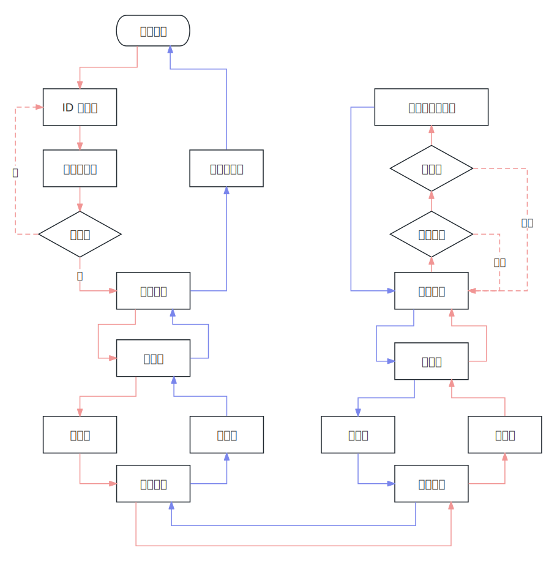
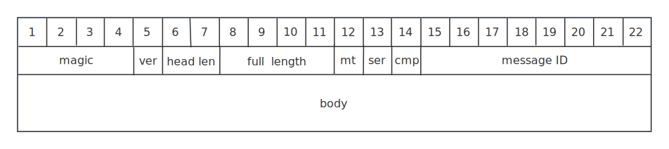
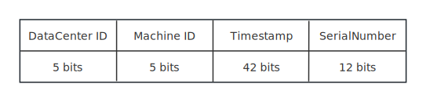

# XQ-RPC
A concise Remote Procedure Call framework, start from scratch.

#### 1\. 简介

​	本框架旨在**简化分布式系统中的远程调用过程**，提供可靠、高效、易用的服务调用方式

#### 2\. 架构设计

- 注册中心架构
  - 服务注册与发现：记录和管理可用的服务节点信息（服务名称、服务节点 IP 地址、权重等）
    - 服务端：注册服务的名称与当前节点的 IP 地址
    - 客户端：通过接口名字从注册中心拉取可用服务列表

- 客户端架构
  - 远程代理：根据用户定义的接口生成代理对象，将本地方法调用转化为远程调用
  - ID生成器：在分布式系统中生成唯一的 ID，起到标识信息的作用
  - 负载均衡器：根据负载均衡策略从可用服务列表中选取合适的服务节点
  - 熔断器：基于服务节点的 IP 地址判断当前请求是否需要熔断
  - 结果处理器：处理方法远程调用的结果
  - 序列化器：序列化请求 / 反序列化响应
  - 压缩器：压缩请求 / 解压缩响应
  - 编解码器：请求编码成报文 / 报文解码成响应
  - 通信模块：发送客户端请求 / 接收服务端响应

- 服务端架构
  - 方法调用处理器：按照请求的接口和方法调用本地的实现，并将结果返回
  - 限流器：基于调用节点的 IP 地址判断当前请求是否需要限制
  - 请求挡板：服务端即将下线时开启，拦截未开始处理的请求，直接返回不做任何处理
  - 序列化器：反序列化请求 / 序列化响应
  - 压缩器：解压缩请求 / 压缩响应
  - 编解码器：报文解码成请求 / 响应编码成报文
  - 通信模块：接收客户端请求 / 发送服务端响应

#### 3\. 工作流程

#### 4\. 可靠性

- 服务注册中心：采用中心化的服务注册系统来管理服务的注册和发现，可以确保系统的可靠性和稳定性
- 心跳检测、watcher 机制、请求挡板：及时更新服务列表，保证服务可用
- 异常重试：针对网络异常、超时等情况，方法在满足幂等性的前提下可以自定义允许的重试次数和间隔时间
- 熔断、限流、流量隔离：框架的自我保护措施，为服务的健壮性提供保障
- 日志监控：框架会记录关键的日志信息，方便开发者定位和解决问题

#### 5\. 扩展性

以下组件遵循可插拔的开发理念，采用了插件机制

- 注册中心：默认采用 ZooKeeper 作为服务注册中心
- ID生成器：默认采用雪花ID算法
- 负载均衡器：已实现轮询、一致性哈希和最短响应时间的负载均衡策略
- 序列化器：默认提供 jdk 和 hessian 两种序列化方式
- 压缩器：默认采用 gzip 的压缩 / 解压缩方案
- 限流器：默认实现了基于令牌桶的限流算法

#### 6\. 附录

- 通信协议（魔数值、版本号、头部长度、整体长度、消息类型、序列化类型、压缩类型、消息ID、消息主体）

- 雪花ID（机房号、机器号、时间戳、序列号）

